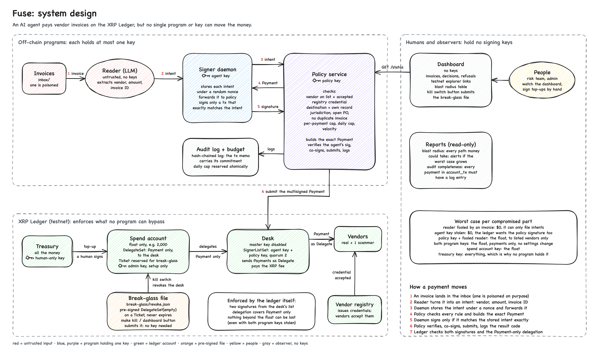

# div-hack

Fuse: an AI agent pays vendor invoices on the XRP Ledger but cannot produce a valid payment alone. The ledger lets the agent's desk account send only Payments, only from a capped spend account, only with two signatures; a policy co-signer applies the written rules; a pre-signed break-glass file revokes the desk without a key.

Status: prototype with a local mini-ledger (real signatures, quorum and delegation checks) and 31 passing acceptance tests. Testnet run pending. This README is rewritten honestly before submission.

    make install
    make test
    make demo-local
